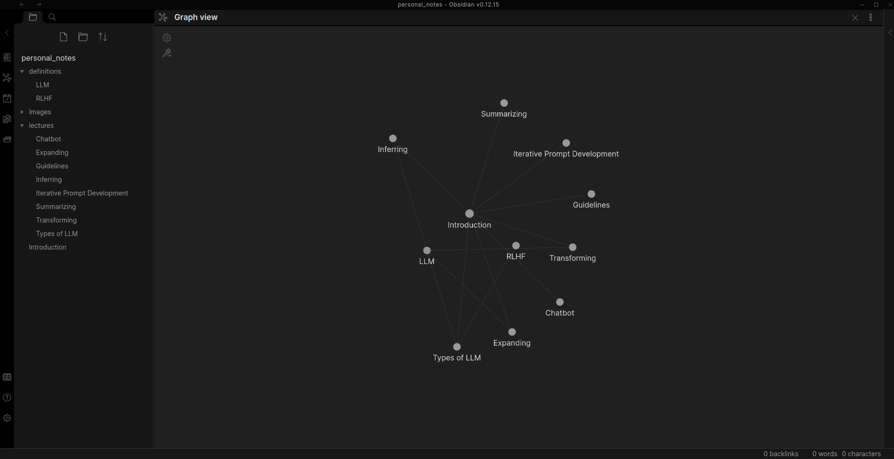

# Prompt Engineering for Developers

This repository contains my personal notes on the new course by Deeplearning.AI: "Prompt Engineering for Developers" using
**Obsidian: The Note-Taking Software Application**.

> **_NOTE:_**  This README.md has been generated using ChatGPT 😂😂😂

### Introduction

Prompt engineering refers to the process of crafting effective prompts or instructions for language models to generate
desired outputs. It involves carefully designing the input text that guides the model's behavior and influences the 
quality and relevance of the generated responses. Prompt engineering is a crucial aspect of working with language models
as it helps to shape and control the output in a desired manner.

By formulating well-crafted prompts, developers can guide language models to provide more accurate, specific, and 
contextually appropriate responses. This process involves considering various factors such as the desired outcome,
the specific domain or topic, the level of detail required, and any constraints or preferences. Effective prompt 
engineering can improve the reliability and usefulness of language models in a wide range of applications, including 
chatbots, content generation, translation, summarization, and more.

### What is Obsidian?

Obsidian is a powerful and versatile note-taking software application that enables users to create, organize, and link 
their digital notes in a seamless and interconnected manner. It is designed to facilitate knowledge management and
promote a holistic approach to note-taking, making it an ideal tool for individuals, researchers, writers, and 
professionals in various fields.

With Obsidian, notes are created in plain text using the Markdown syntax, providing a simple and intuitive way to 
capture ideas and information. The software leverages the concept of a "knowledge graph," where notes are interconnected
through bi-directional links, forming a web of related ideas. This graph-based approach allows users to explore and 
navigate their notes in a non-linear fashion, uncovering new connections and insights along the way.

Key Features of Obsidian:

1. **Bi-directional Linking**: Obsidian's core feature is the ability to create bi-directional links between notes. This allows for easy discovery of relationships between ideas and provides a flexible and dynamic structure for organizing information. By simply placing double brackets around a word or phrase, Obsidian automatically creates a link to another note with a matching title.

2. **Graph View**: The Graph View in Obsidian provides a visual representation of the interconnectedness of notes. It allows users to visualize their knowledge graph and explore relationships between notes in a graphical format. This feature is particularly useful for getting an overview of complex information architectures and identifying knowledge gaps.

3. **Markdown Editing**: Obsidian uses Markdown for note creation and editing, providing a lightweight and flexible syntax for formatting text. Markdown allows users to add headers, lists, images, code blocks, and more to their notes, making it easy to structure and style content. Obsidian also supports LaTeX equations, making it a valuable tool for researchers and academics.

4. **Backlinking and Transclusion**: Obsidian automatically generates backlinks, displaying a list of all the notes that link to a particular note. This feature enhances the discoverability of connections and facilitates a multidimensional exploration of ideas. Additionally, Obsidian supports transclusion, allowing users to embed the content of one note within another note. This enables the creation of composite notes that aggregate information from multiple sources.

To get started with Obsidian, you can visit the official Obsidian website at [https://obsidian.md](https://obsidian.md). The website provides detailed documentation, tutorials, and a vibrant community forum where users can learn and exchange knowledge.

### How to use this notes?

Download Obsidian from this [link](https://obsidian.md), clone the repo and open it using Obsidian. Simple, right?

