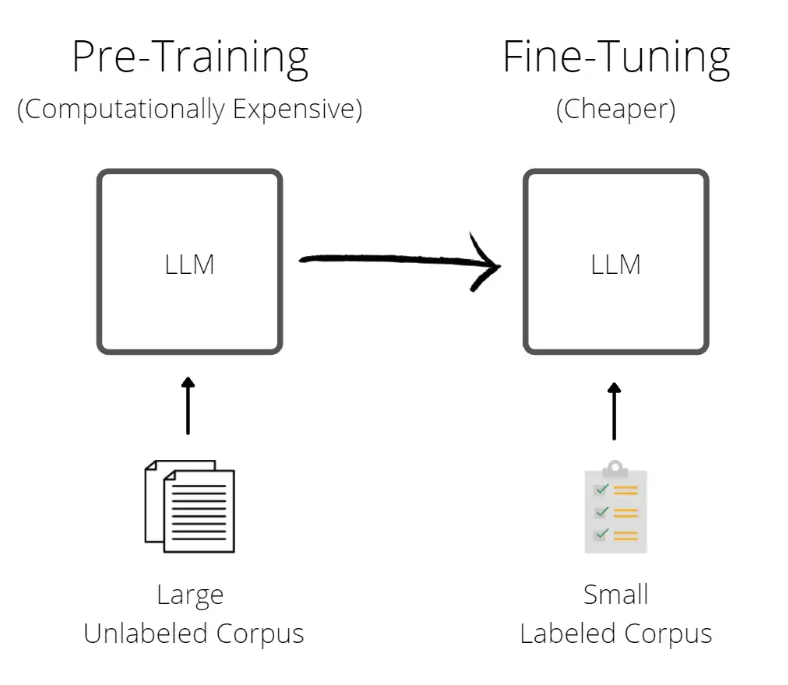

# Prompt Engineering for Developers

This repository contains my personal notes on the new course by Deeplearning.AI: "Prompt Engineering for Developers".

## Introduction

  

There are two types of large language models (LLM):

* **Base LLM**: Predicts next word based on text training data.

* **Instruction Tuned LLM**: Fine-tune on instructions and good attempts at following those instructions. 
The way to accomplish this is by using a technique called **Reinforcement Learning with Human Feedback (RLHF)**.

## Guidelines

There are two main principles for prompting:

1. **Principle 1**: Write clear and specific instructions
2. **Principle 2**: Give the model time to think

These principles are materialized into several tactics. A hands-on exploration of these tactics can be found in 
`lessons/guidelines.ipynb`.

