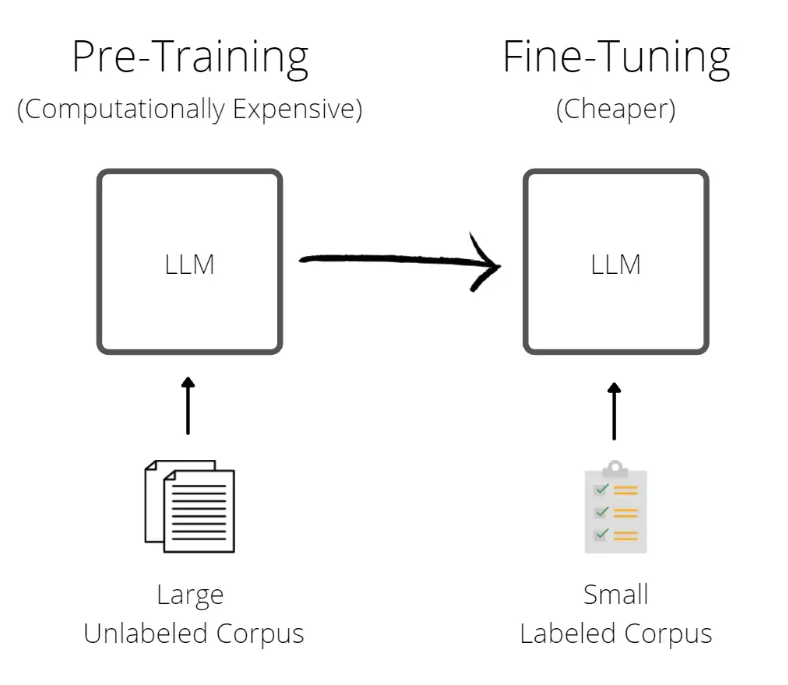

There are two types of [Large Language Models (LLM)](definitions/LLM):  
  
* **Base LLM**: Predicts next word based on text training data.  
  
* **Instruction Tuned LLM**: Fine-tune on instructions and good attempts at following those instructions.   

The way to accomplish this is by using a technique called [**Reinforcement Learning with Human Feedback (RLHF)**](definitions/RLHF).  
